<picture>
  
</picture>

### About Me

I'm **Tharusha Madhuranga Perera**, an undergraduate at the **University of Kelaniya** who enjoys turning real-world problems into reliable digital solutions.

- 🎓 Undergraduate at the **University of Kelaniya**
- 💊 Currently building a **Pharmacy Support System** for Sri Lanka
- ⚙️ Focusing on **backend engineering, system design, and DevOps**
- ☁️ Learning **cloud technologies and advanced system architecture**
- 🚀 Working toward becoming a **full-stack engineer**

#### Let's Connect

Ideas, code, and meaningful conversations are always welcome. If you are interested in software development, backend systems, frontend experiences, or DevOps, feel free to reach out.

 [LinkedIn](https://linkedin.com/in/tharusha-madhuranga-perera)&nbsp;&nbsp;&nbsp;
 [Email](mailto:tharushamadurangaperera@gmail.com)&nbsp;&nbsp;&nbsp;
 [Instagram](https://instagram.com/t_h_arusha)

Enjoy!
